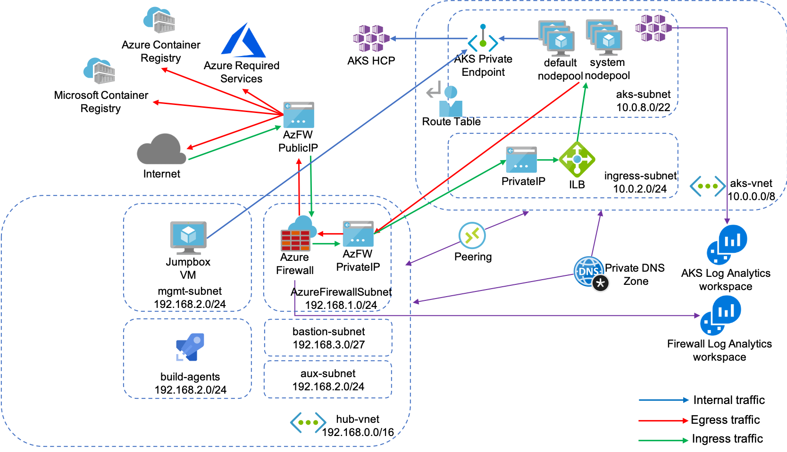

# Security Baseline AKS
The goal of this repo is to have a baseline secure AKS setup with private Kubernetes API and egress traffic lockdown

## Architecture Diagram



## Out of Scope
* In-cluster Security (Network Policies, OPA, mTLS, etc)
* Secure CI/CD pipelines
* Container Security (AppArmor, seccomp)

## How to start

### Download and Install Terraform
Download a proper package for your operating system from [here](https://www.terraform.io/downloads.html). Alternatively, you can use [Azure Cloud Shell](https://shell.azure.com/), that has Terraform binary pre-installed.

### Download and Install Azure CLI
Follow the instructions for your operating system [here](https://docs.microsoft.com/en-us/cli/azure/install-azure-cli?view=azure-cli-latest). Alternatively, you can use [Azure Cloud Shell](https://shell.azure.com/), that has Azure CLI binary pre-installed.

### Clone this repo and go to a terraform directory
```bash
git clone https://github.com/akamenev/sec-base-aks
cd sec-base-aks/terraform
```

### Login to Azure with Azure CLI and set environment variables
```bash
az login

TF_VAR_cluster_name="sec-aks"               # Name of a cluster
TF_VAR_username="aksadmin"                  # Username for a jumpbox and cluster user
TF_VAR_resource_group_name="sec-aks"        # Resource group name
TF_VAR_location="WestEurope"                # Location 
TF_VAR_ssh_public_key="~/.ssh/id_rsa.pub"   # Location of ssh key to use
TF_VAR_dns_prefix="sec-aks"                 # DNS prefix for a cluster
TF_VAR_kubernetes_version="1.15.7"          # Cluster version
TF_VAR_acr_name="secureacr"                 # Name of container registry
```

### Initialize Terraform and apply the template
```bash
terraform init
terraform apply
```